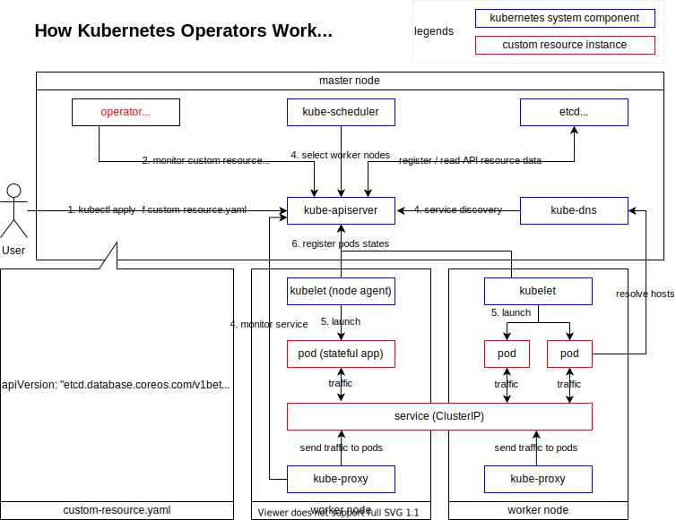
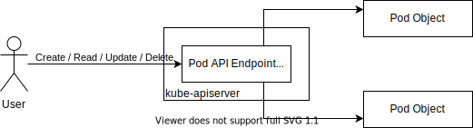
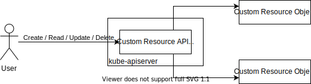
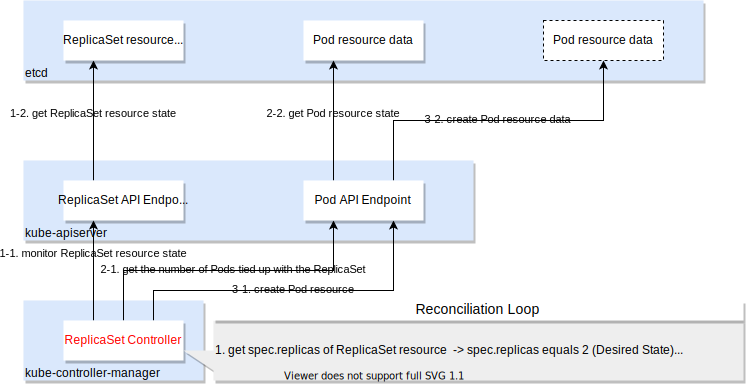
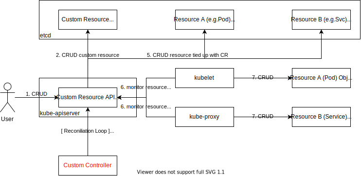
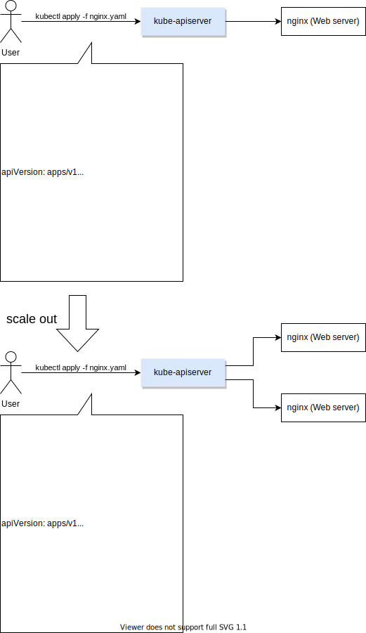
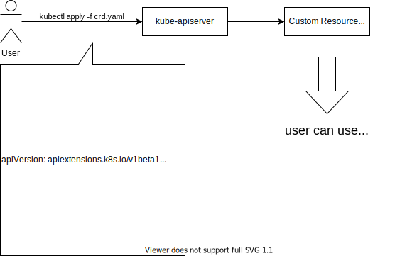
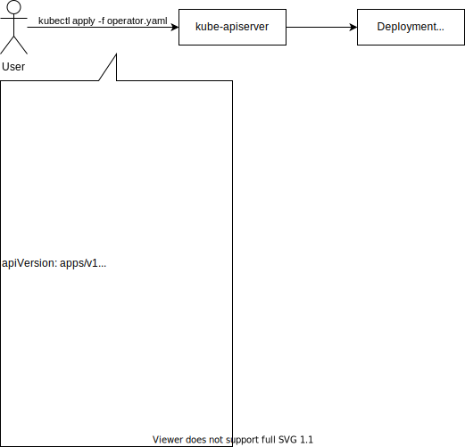

# Kubernetes Operator

## Reference
* API Reference
  * [CustomResourceDefinition](https://kubernetes.io/docs/reference/generated/kubernetes-api/v1.22/#customresourcedefinition-v1-apiextensions-k8s-io)
* Webサイト
  * [オペレーターパターン | Kubernetes](https://kubernetes.io/ja/docs/concepts/extend-kubernetes/operator/)
  * [カスタムリソース | Kubernetes](https://kubernetes.io/ja/docs/concepts/extend-kubernetes/api-extension/custom-resources/)
  * [Kubernetes Operator とは redhat.com](https://www.redhat.com/ja/topics/containers/what-is-a-kubernetes-operator)
* ebook
  * [O’Reilly: Kubernetes Operators: Automating the Container Orchestration Platform](https://www.redhat.com/ja/resources/oreilly-kubernetes-operators-automation-ebook)
* 書籍
  * [青山真也 (2020) Kubernetes 完全ガイド, 株式会社インプレス](https://book.impress.co.jp/books/1119101148)
  * [澤橋松王,大津浩司,青山真巳,河角修,鈴木洋一朗,関克隆 (2020) OpenShift徹底活用ガイド, 株式会社C&R研究所](https://www.c-r.com/book/detail/1362)

## Kubernetes Operator の概要
Kubernetes Operator はカスタムリソースを使用する Kubernetes へのソフトウェア拡張 (カスタムコントローラー) であり、
**ステートフルアプリケーションを自動的に運用** (インスタンス作成、スケーリング、属性変更、etc) するための機能である。



## ステートレスとステートフルの違い
アプリケーションはステートレス型とステートフル型に分類できる。
それぞれの特徴は以下の通りである。

||ステートレス型|ステートフル型|
|:--|:--|:--|
|アプリケーション例|Webサーバー / アプリケーションサーバー|DB|
|状態の有無|無|有|
|障害復旧の難度|易 (コンテナの再起動で復旧可能)|難 **(固有の運用ナレッジが必要)**|
|障害復旧の方法|Deployment による自動復旧|**運用者が手順書を基にリカバリ**|

## カスタムリソース とは
カスタムリソースの説明の前にリソースを説明する。
**リソースは、Kubernetes API のエンドポイント**で、特定の API オブジェクトのコレクションを保持する。
例えば、Pod の Kubernetes API はリソースであり、この API は、インスタンス作成 (create)、属性変更 (edit)、状態取得 (get)、削除 (delete)などのコレクションを含有している。



カスタムリソースは、Kubernetes API の拡張で、
**Kubernetes 本体のコードを変更せずに、独自のリソースを容易に追加するための機能**である。

カスタムリソースは、稼働しているクラスターに動的に登録され、現れたり、消えたりし、クラスター管理者はクラスター自体とは無関係にカスタムリソースを更新できる。
一度、カスタムリソースがインストールされると、ユーザーは kubectl を使い、Pod と同様に、オブジェクトを作成、アクセスすることが可能である。



## カスタムコントローラー とは
カスタムリソースは、単純に構造化データを格納、取り出す機能を提供する。カスタムリソースをカスタムコントローラーと組み合わせることで、インスタンス作成、属性変更、状態取得等が可能となり、カスタムリソースは真の[宣言的 API](https://kubernetes.io/ja/docs/concepts/extend-kubernetes/api-extension/custom-resources/#%E5%AE%A3%E8%A8%80%E7%9A%84api) を提供する。

宣言的 API は、リソースのあるべき状態 (Desired State) を宣言することを可能にし、Kubernetes オブジェクトの現在の状態 (Current State、Actual State または Observed State) を、あるべき状態に同期し続けるように動く([Reconciliation Loop; 制御ループ または 調停ループ](https://kubernetes.io/ja/docs/concepts/architecture/controller/))。例えば、ユーザーが「コンテナは2つ起動されていること」という宣言を行えば、その宣言に従って Kubernetes が2つのコンテナを起動する。この仕組みはKubernetes標準のコントローラー (e.g. Deployment Controller、ReplicaSet Controller) でも利用されている。



宣言的 API の対義語は 命令的 API と呼ばれる。これはアプリケーションに対し、具体的な処理内容を命令することで順次実行させることを指す。

稼働しているクラスターのライフサイクルとは無関係に、カスタムコントローラーをデプロイ、更新することが可能である。
カスタムコントローラーはあらゆるリソースと連携できるが、
カスタムリソースと組み合わせると特に効果を発揮する。
カスタムリソースとカスタムコントローラーを組み合わせて使用することを[オペレーターパターン](https://kubernetes.io/ja/docs/concepts/extend-kubernetes/operator/)と呼ぶ。



## カスタムリソース・カスタムコントローラーは何故必要なのか
Web アプリケーション、モバイルバックエンド、API サービスなどのステートレスアプリケーションは、Kubernetes の Deployment 等で管理・スケーリングできる。
これらのアプリケーションの運用方法について知識を追加する必要はない。



一方、データベースや監視システムなどのステートフルアプリケーションの場合は、
Kubernetes にはないドメイン固有の知識を追加する必要がある。
このようなアプリケーションをスケーリング、アップグレード、再構成するには、運用知識が必要である。

**Kubernetes Operator はこの固有のドメイン知識を
Kubernetes 拡張として導入し、
アプリケーションのライフサイクルを管理して自動化**する。

## カスタムリソースを追加する
Kubernetes は独自のリソース (カスタムリソース) を容易に追加して、Kubernetes を拡張できるように作られている。

カスタムリソース定義 (CustomrResourceDefinition; CRD) API リソースは、カスタムリソースを定義する。
CRDオブジェクトを定義することで、指定した名前、スキーマで新しいカスタムリソースが作成される。



カスタムリソースの追加は CRD を使用する以外に API アグリゲーションを使用することもできる。
カスタムリソースの追加方法の選択は[公式ドキュメント](https://kubernetes.io/ja/docs/concepts/extend-kubernetes/api-extension/custom-resources/#%E3%82%AB%E3%82%B9%E3%82%BF%E3%83%A0%E3%83%AA%E3%82%BD%E3%83%BC%E3%82%B9%E3%81%AE%E8%BF%BD%E5%8A%A0%E6%96%B9%E6%B3%95%E3%82%92%E9%81%B8%E6%8A%9E%E3%81%99%E3%82%8B)を参照する。

## Kubernetes Operator をデプロイする
オペレーターをデプロイする最も一般的な方法は、Custom Resource Definition とそれに関連するコントローラーをクラスターに追加することである。
このコントローラーは通常のコンテナアプリケーションを動かすのと同じように、コントロールプレーン外で動作する。
例えば、コントローラーをDeploymentとしてクラスター内で動かすことができる。



## Kubernetes Operator を利用する

### [etcd-operator](https://github.com/coreos/etcd-operator) を利用する例

etcdは分散型Key-Valueストアであり、一種の軽量データベースである。
etcd管理者は、次の方法を知っている必要がある。
* エンドポイントの構成・作成を実施し、新しいノードをetcdクラスターに参加させる。
* etcdクラスターを永続ストレージに接続する。
* etcdクラスターのデータと構成をバックアップする。
* etcdクラスターを新しいetcdバージョンにアップグレードする。

etcd-operatorは上記の方法を把握している。
以下は、実際にetcd-operatorを利用してetcdクラスターのデプロイ・スケールアウトを実施する例である。

1. Kubernetes を利用可能な環境に移動する。(e.g. [Kubernetes Playground | Katacoda](https://www.katacoda.com/courses/kubernetes/playground))
    - 注意: Kubernetes Playgroundで社外秘情報を扱わないこと。
2. etcd-operator-workspace ディレクトリを作成し、カレントディレクトリを移動する。
   ```
   $ mkdir etcd-operator-workspace && cd etcd-operator-workspace
   ```
3. Operator のマニフェストファイル (deployment.yaml) を作成する。
   ```yaml
   apiVersion: apps/v1
   kind: Deployment
   metadata:
     name: etcd-operator
   spec:
     replicas: 1
     selector:
       matchLabels:
         name: etcd-operator
     template:
       metadata:
         labels:
           name: etcd-operator
       spec:
         containers:
         - name: etcd-operator
           image: quay.io/coreos/etcd-operator:v0.9.4
           command:
           - etcd-operator
           # Uncomment to act for resources in all namespaces. More information in doc/user/clusterwide.md
           #- -cluster-wide
           env:
           - name: MY_POD_NAMESPACE
             valueFrom:
               fieldRef:
                 fieldPath: metadata.namespace
           - name: MY_POD_NAME
             valueFrom:
               fieldRef:
                 fieldPath: metadata.name
   ```
4. etcd-operator をデプロイする。
   ```
   $ kubectl apply -f deployment.yaml
   ```
5. etcd クラスタのマニフェストファイル (etcd-cluster.yaml) を作成する。
   ```yaml
   apiVersion: "etcd.database.coreos.com/v1beta2"
   kind: "EtcdCluster"
   metadata:
     name: "example-etcd-cluster"
     ## Adding this annotation make this cluster managed by clusterwide operators
     ## namespaced operators ignore it
     # annotations:
     #   etcd.database.coreos.com/scope: clusterwide
   spec:
     size: 1
     version: "3.2.13"
   ```
6. etcd クラスタを作成する。
   ```
   $ kubectl apply -f etcd-cluster.yaml
   ```
7. etcd Pod の数を確認する。
   ```
   $ kubectl get pods -l app=etcd
   ```
8. etcd Pod をスケールアウトする。
   ```yaml
   # etcd-cluster.yaml
   apiVersion: "etcd.database.coreos.com/v1beta2"
   kind: "EtcdCluster"
   metadata:
     name: "example-etcd-cluster"
   spec:
     # scale size to 2
     size: 2
     version: "3.2.13"
   ```
   ```
   $ kubectl apply -f etcd-cluster.yaml
   ```
9.  etcd Pod の数を確認する。
    ```
    $ kubectl get pods -l app=etcd
    ```

* NOTE:
  * [etcd-operator が CustomResourceDefinition を作成](https://github.com/coreos/etcd-operator/blob/13a1831f9744207b39733bbe91413ca2e389aa40/pkg/util/k8sutil/crd.go#L54)しているため、CustomResourceDefinition を手動で作成する必要はない。


**実行例**
```
controlplane $ mkdir etcd-operator-workspace && cd etcd-operator-workspace

controlplane $ vi deployment.yaml

controlplane $ kubectl apply -f deployment.yaml 
deployment.apps/etcd-operator created

[confirm operator pod]
controlplane $ kubectl get pods
NAME                             READY   STATUS    RESTARTS   AGE
etcd-operator-76f5f4df89-mvftp   1/1     Running   0          63s

[confirm custom resource definition]
controlplane $ kubectl get crd
NAME                                    CREATED AT
etcdclusters.etcd.database.coreos.com   2021-10-27T21:36:52Z

[confirm custom resource definition detail]
controlplane $ kubectl get crd etcdclusters.etcd.database.coreos.com -o yaml
apiVersion: apiextensions.k8s.io/v1
kind: CustomResourceDefinition
metadata:
  creationTimestamp: "2021-11-09T23:22:57Z"
  generation: 1
  managedFields:
  - apiVersion: apiextensions.k8s.io/v1beta1
    fieldsType: FieldsV1
    fieldsV1:
      f:spec:
        f:conversion:
          .: {}
          f:strategy: {}
        f:group: {}
        f:names:
          f:kind: {}
          f:listKind: {}
          f:plural: {}
          f:shortNames: {}
          f:singular: {}
        f:preserveUnknownFields: {}
        f:scope: {}
        f:version: {}
        f:versions: {}
      f:status:
        f:storedVersions: {}
    manager: etcd-operator
    operation: Update
    time: "2021-11-09T23:22:57Z"
  - apiVersion: apiextensions.k8s.io/v1
    fieldsType: FieldsV1
    fieldsV1:
      f:status:
        f:acceptedNames:
          f:kind: {}
          f:listKind: {}
          f:plural: {}
          f:shortNames: {}
          f:singular: {}
        f:conditions: {}
    manager: kube-apiserver
    operation: Update
    time: "2021-11-09T23:22:57Z"
  name: etcdclusters.etcd.database.coreos.com
  resourceVersion: "730"
  selfLink: /apis/apiextensions.k8s.io/v1/customresourcedefinitions/etcdclusters.etcd.database.coreos.com
  uid: 24792f09-2275-4705-a9b6-24b9a20ef391
spec:
  conversion:
    strategy: None
  group: etcd.database.coreos.com
  names:
    kind: EtcdCluster
    listKind: EtcdClusterList
    plural: etcdclusters
    shortNames:
    - etcd
    singular: etcdcluster
  preserveUnknownFields: true
  scope: Namespaced
  versions:
  - name: v1beta2
    served: true
    storage: true
status:
  acceptedNames:
    kind: EtcdCluster
    listKind: EtcdClusterList
    plural: etcdclusters
    shortNames:
    - etcd
    singular: etcdcluster
  conditions:
  - lastTransitionTime: "2021-11-09T23:22:57Z"
    message: no conflicts found
    reason: NoConflicts
    status: "True"
    type: NamesAccepted
  - lastTransitionTime: "2021-11-09T23:22:57Z"
    message: the initial names have been accepted
    reason: InitialNamesAccepted
    status: "True"
    type: Established
  storedVersions:
  - v1beta2

controlplane $ vi etcd-cluster.yaml

controlplane $ kubectl apply -f etcd-cluster.yaml 
etcdcluster.etcd.database.coreos.com/example-etcd-cluster created

controlplane $ kubectl get pods -l app=etcd
NAME                              READY   STATUS    RESTARTS   AGE
example-etcd-cluster-pxjxwr456m   1/1     Running   0          2m30s

controlplane $ vi etcd-cluster.yaml 
controlplane $ kubectl apply -f etcd-cluster.yaml 
etcdcluster.etcd.database.coreos.com/example-etcd-cluster configured

controlplane $ kubectl get pods -l app=etcd
NAME                              READY   STATUS    RESTARTS   AGE
example-etcd-cluster-9bj9cfth6t   1/1     Running   0          40s
example-etcd-cluster-pxjxwr456m   1/1     Running   0          4m29s
```

### Red Hat OpenShift Logging を利用する例
[第3章 OpenShift Logging のインストール OpenShift Container Platform 4.8 | Red Hat Customer Portal](https://access.redhat.com/documentation/ja-jp/openshift_container_platform/4.8/html/logging/cluster-logging-deploying)を参照する。

## Red Hat OpenShift Container Platform で Operator を利用する
[第3章 管理者タスク OpenShift Container Platform 4.8 | Red Hat Customer Portal](https://access.redhat.com/documentation/ja-jp/openshift_container_platform/4.8/html/operators/_administrator-tasks#olm-adding-operators-to-a-cluster) を参照する。

## Kubernetes Operator を自作する
[第4章 Operator の開発 OpenShift Container Platform 4.8 | Red Hat Customer Portal](https://access.redhat.com/documentation/ja-jp/openshift_container_platform/4.8/html/operators/_developing-operators) を参照する。
